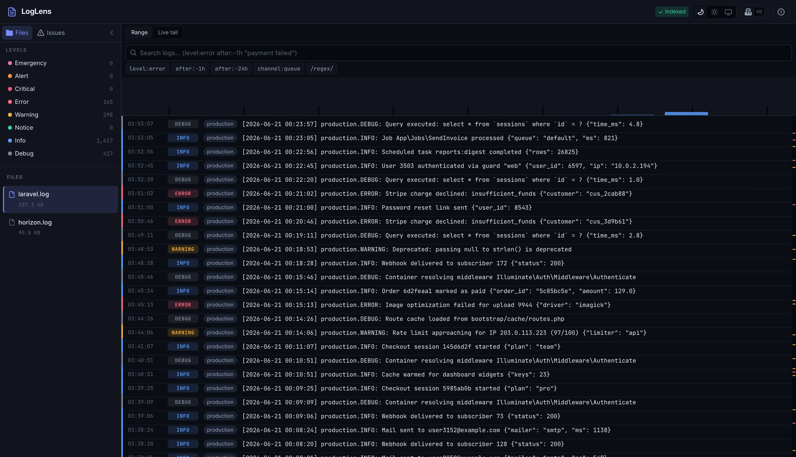
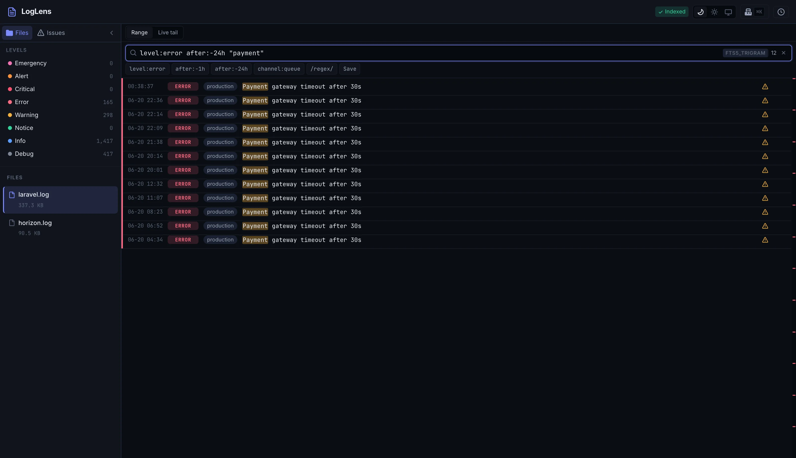
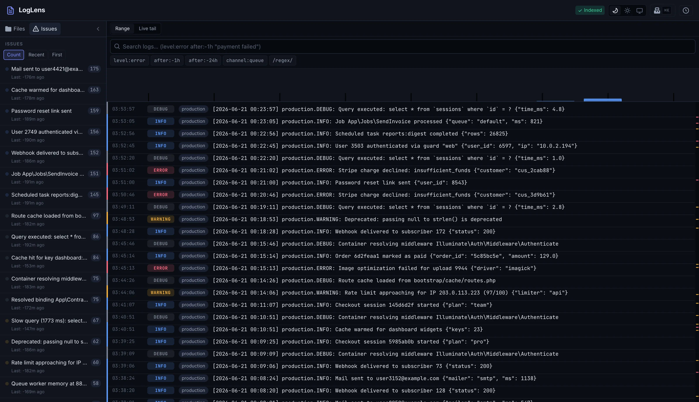
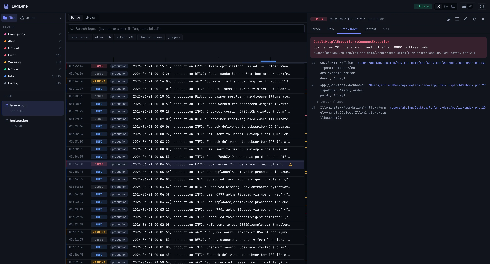

<div align="center">

# 🔍 LogLens

**A production-scale log viewer for Laravel.**

Open a 5 GB `laravel.log` in under 100 ms · search it in under 200 ms · never hang the UI on a cache miss again.

[](https://packagist.org/packages/abdian/loglens)
[](https://github.com/abdian/loglens/actions/workflows/ci.yml)
[](https://packagist.org/packages/abdian/loglens)
[](https://laravel.com)
[](https://packagist.org/packages/abdian/loglens)
[](LICENSE)

[Installation](docs/installation.md) ·
[Configuration](docs/configuration.md) ·
[Query language](docs/query-language.md) ·
[Security](docs/security.md) ·
[CLI](docs/cli.md) ·
[JSON API](docs/api.md)

<br>



</div>

```bash
composer require abdian/loglens
```

Then visit `/loglens` — no publish step, no npm, no migrations, no configuration required.

---

## The one architectural decision that matters

Most Laravel log viewers keep their index in the **Laravel cache**. That choice is the root of two failure modes you eventually hit at scale: the UI hangs while a large file is (re-)scanned, and searches return zero results after the cache is evicted or cleared. Because the cache is load-bearing, neither can be solved without changing the storage model.

LogLens stores a **persistent on-disk SQLite sidecar index** per log file under `storage/loglens/`. That index survives cache clears, deploys, load-balancer key skew, and Octane restarts. The entire bug class is structurally impossible.

---

## Headline differentiators

The column on the right describes the common design of a cache-backed Laravel log
viewer — the pattern LogLens was built to move past. It is a description of an
architecture, not a benchmark of any one package.

| | LogLens | Typical cache-backed log viewer |
|---|---|---|
| Index storage | Per-file SQLite sidecar on local disk | Laravel cache (evictable) |
| Multi-GB file open | Instant tail-first read (3.6 ms on 500 MB, no index needed) | Full-file scan on every open; degrades on large files |
| Search | FTS5 + trigram — index once, search many | Re-scans the raw file on every query |
| Query language | `level:error after:-1h "payment failed" -channel:horizon` | Raw regex only |
| Live tail in the browser | SSE + polling fallback, works on Windows and shared hosting | Manual refresh |
| JSON/NDJSON logs | Auto-detected, no class required | Often needs a custom log class |
| `.gz` reading | Transparent, indexed | Usually unsupported |
| Error grouping | Sentry-style Issues view — deterministic fingerprints, sparklines | Typically none |
| RTL / Farsi locale | Supported via CSS logical properties | Rarely supported |
| PHP/Laravel support | Laravel 8–13, PHP 8.0–8.5, every combination CI-tested | Varies |
| Required extensions | None (pdo_sqlite + zlib used opportunistically) | Varies |
| Install | `composer require` → visit `/loglens` | Often requires a config publish |

---

## Feature overview

### Persistent index engine

One SQLite file per log file lives under `storage/loglens/`. It records byte offsets, timestamps, levels, fingerprint hashes, and pre-aggregated per-hour/level counts. Indexing is incremental — only appended bytes are re-scanned. Rotation and truncation are detected via file size, inode, and a fingerprint of the first 4 KB.

When `pdo_sqlite` is unavailable, LogLens falls back to a packed binary sidecar that supports all browsing operations except full-text search.

### Instant first paint

Opening any file immediately serves the newest page via backward chunked reads — no index is required. The response carries `indexState: none|building|ready` so the UI can progressively enable index-backed features (full-text search, histogram, jump-to-date) as they become available. You see logs in under 100 ms on a 5 GB file.

### Format support

Built-in parsers: Laravel/Monolog LineFormatter (multi-line stack traces, dual JSON context tails from Laravel 11+), NDJSON/JsonFormatter (auto-detected), Horizon (both formats), Apache/Nginx access logs, Apache/Nginx error logs, PHP-FPM, PostgreSQL, Redis, and Supervisor.

Custom formats can be declared in `config/loglens.php` with a named-capture PCRE — no PHP class required. A class-based API and an adapter for existing opcodesio `Log` subclasses are also available.

Compressed `.gz` files are read transparently through zlib stream wrappers.

### FTS5 search with a query language

```
level:error after:-1h "payment failed" -channel:horizon
level:>=warning after:2026-06-01 before:2026-06-30
context.user_id:42 OR context.user_id:43
/TimeoutException|ConnectionException/i
```

The query language supports bare terms (implicit AND), quoted phrases, `field:value` filters, level comparisons, absolute and relative time filters, negation, OR with parentheses, prefix wildcards (`error*`), and opt-in regex. The same grammar drives the web UI, the JSON API, `loglens:search`, `loglens:tail`, and live-tail server-side filtering.

Search executes against the SQLite FTS5 index. A capability ladder degrades gracefully: FTS5+trigram → FTS5 unicode61 → SQL LIKE → index-assisted streamed PCRE scan. The active tier is visible in the diagnostics panel.



### Live tail in the browser

Server-Sent Events over a raw `StreamedResponse` (compatible with Laravel 8+). Short 45-second windows with automatic reconnect ensure compatibility with common proxy read timeouts. A client-side watchdog switches transparently to offset-based polling when a buffering middlebox is detected, or when running under Octane/Swoole where streaming responses buffer by design.

Multi-file tailing multiplexes over a single connection using per-file SSE event names.

### Error grouping (Issues view)

Every entry is fingerprinted at index time. Exception entries get two deterministic hashes: one on `exception_class|top_app_frame_file|top_app_frame_line` and one on `exception_class|throw_site`. Non-exception entries are normalized by masking UUIDs, dates, IPs, numbers, and SQL bindings, producing a stable group title.

The Issues view shows each group with its occurrence count, first/last seen, level, and a sparkline — collapsing thousands of identical errors into one actionable row. A "new since" diff reports fingerprints that first appeared after a given timestamp (useful after a deploy).



### Analytics

A level-stacked volume histogram above the entry list is answered entirely from pre-aggregated statistics — no entry scans, under 100 ms on any indexed file. Dragging a range on the histogram zooms the entry list to that window.

### File management done right

- **Clear** uses `ftruncate` with an exclusive lock, preserving the inode so long-running writers (queue workers, Horizon) continue appending to the same file without interruption.
- **Delete** removes the file and writes a tombstone so a same-path replacement starts a fresh index.
- **Delete a single entry** soft-deletes one row in the index (the raw file is never rewritten); it disappears from listings, search, stats, and groups, and the deletion survives a full re-index.
- **Download** uses short-TTL signed URLs bound to the authenticated user. Streaming zip downloads never materialize the full archive on disk. Partial downloads ("last 50 MB") are supported for large files.
- **Prune** (`loglens:prune`) automates retention by age and total size, with optional compression to `.gz` and a `--dry-run` mode.

### Web UI

Vue 3 + Pinia + Tailwind SPA served from the vendor directory — no publish step, no npm for users. Three-pane IDE layout: facet sidebar, virtualized entry list with level/time histogram, and a detail drawer with a Flare-style stack trace pane including editor deep links (PhpStorm, VS Code, Cursor, and more) with configurable remote-to-local path mapping.

Keyboard-first: `j`/`k` row navigation, `/` focuses search, `Cmd+K` opens the command palette, `e`/`E` jumps between errors. Dark mode by default. Full RTL support for Persian (`fa`) locale via CSS logical properties.



### JSON API and `api_only` mode

Every viewer operation is available through a versioned JSON API under `{prefix}/api`. Setting `api_only = true` disables UI and asset routes while keeping the full API operational — useful for headless dashboards or custom frontends.

### CLI companion

```bash
php artisan loglens:index          # build/update all indexes
php artisan loglens:index --watch  # continuous incremental indexing
php artisan loglens:search "level:error after:-24h" --json
php artisan loglens:tail --query="level:>=warning"
php artisan loglens:stats --json
php artisan loglens:prune --days=30 --max-total-size=10G --dry-run
```

All commands share the same index and query language as the web UI.

---

## Security

LogLens is **production default-deny**. In any non-local environment, all routes return 403 until you define the `viewLogLens` gate in your application. The identical authorization middleware stack protects web, API, and SSE routes.

Display-time secret redaction is enabled by default: Authorization headers, APP_KEY, AWS keys, Stripe keys, JWTs, and password fields are replaced with `[redacted]` before any content reaches the browser.

See [docs/security.md](docs/security.md) for the full hardening guide.

---

## Requirements

- PHP 8.0–8.5
- Laravel 8–13
- No required PHP extensions (pdo_sqlite and zlib are used opportunistically with graceful fallbacks)

---

## Quick start

```bash
composer require abdian/loglens
```

Visit `https://your-app.test/loglens`. In a local environment the UI is immediately accessible. In production, define the `viewLogLens` gate first — see [docs/security.md](docs/security.md).

To publish the config file:

```bash
php artisan vendor:publish --tag=loglens-config
```

---

## Documentation

- [Installation](docs/installation.md)
- [Configuration reference](docs/configuration.md)
- [Query language](docs/query-language.md)
- [Security hardening](docs/security.md)
- [CLI commands](docs/cli.md)
- [JSON API](docs/api.md)
- [Deployment guide](docs/deployment.md)
- [Migrating from opcodesio/log-viewer](docs/migration-from-opcodesio.md)

---

## License

MIT
